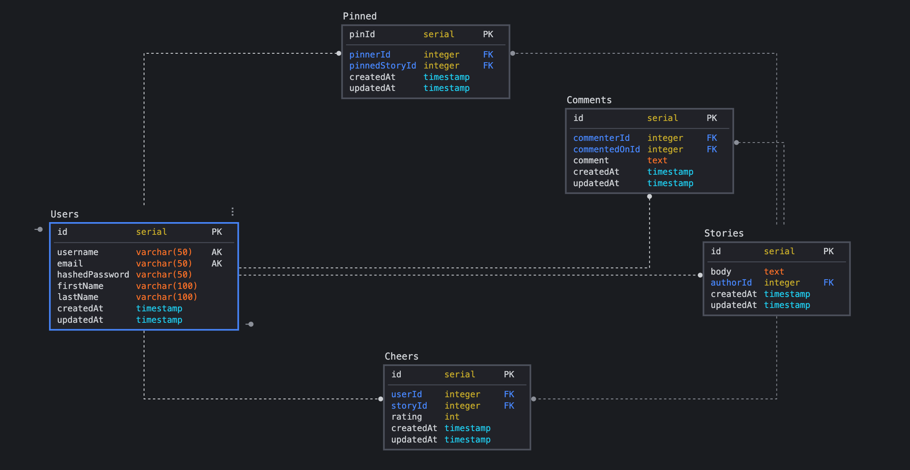

# [Meadium](https://meadium-app.herokuapp.com/)
*By Nick Matthews, Ivan Gentille, Philip Ling, Adam Faidy*

**Table of Contents**
- [Meadium](#meadium)
  - [Meadium at a Glance](#meadium-at-a-glance)
  - [Application Architecture and Technologies Used](#application-architecture-and-technologies-used)
  - [Frontend Overview](#frontend-overview)
    - [AJAX and FETCH](#ajax-and-fetch)
  - [Backend Overview](#backend-overview)
    - [Authentication and Application Security](#authentication-and-application-security)
    - [Relational Database Design](#relational-database-design)
  - [Conclusion & Next Steps](#conclusion--next-steps)

## Meadium at a Glance

Meadium is an online publishing platform modeled on Medium.com, where users can come together and talk about all things alcoholic. They can create accounts, post their own stories, and comment/rate stories created by fellow community members.

## Application Architecture and Technologies Used

Meadium was built through a backend server, with a frontend that communicates via RESTful APIs.

The backend server was created using the Express NodeJS framework. We used a PostgreSQL database to store all user and story data and [Sequelize ORM](https://sequelize.org/) to create relationships between them. Additionally we imported various middlewares, such as [csurf](https://www.npmjs.com/package/csurf) and [express-session](https://www.npmjs.com/package/express-session), in order to maintain security and active user sessions.

The frontend was rendered using the [PUG](https://pugjs.org/api/getting-started.html) templating engine. We used vanilla Javascript and standard CSS for interactivity and styling, respectively.

## Frontend Overview

Meadium is a straightforward CRUD platform, utilizing AJAX and FETCH APIs that allow users to interact with various features of our platform. PUG is the main engine used to render HTML for our clients.

### AJAX and FETCH

One of the more challenging aspects of this project was allowing users to rate and comment on a story without reloading the page every time. We utilized AJAX to await a fetch call to our database and then created new HTML elements that were appended to the body of our PUG. In order to have access to the id of the story to include in our fetch call url, we had to get creative and attach it to our submit button.

Here is a code snippet of our PUG for cheers:

```js
.story.cheers.container
  form.rating#rating-container(action=`/stories/${story.id}/cheers` method="post")
    label(for="5" id=`5|${userId}|${story.id}`)
    label(for="4" id=`4|${userId}|${story.id}`)
    label(for="3" id=`3|${userId}|${story.id}`)
    label(for="2" id=`2|${userId}|${story.id}`)
    label(for="1" id=`1|${userId}|${story.id}`)
```

Here is a code snippet of the fetch call for cheers:

```js
if (e.target.id.includes('|')) {
  const valueInfo = e.target.id.split("|")
  const rating = valueInfo[0]
  const userId = valueInfo[1]
  const storyId = valueInfo[2]
    const data = { rating: rating, useruserId, storyId: storyId }
    await fetch(`http://localhost:8010/stori{storyId}/cheers`, {
      method: "post",
      headers: { 'Content-Type': 'application/json' },
      body: JSON.stringify(data)
    })
```
## Backend Overview

To render the information we needed on the frontend, we used various RESTful APIs to query for relevant data pertaining to the user and the story. We utilized Sequelize ORM to generate different tables for our data and created joined tables and foreign key constraints to connect them.

### Authentication and Application Security

For authentication, we used the express-session library in order to determine that a user was logged in, and if not, redirect him/her to the login page.

For application security, we used the csurf and cookie-parser packages that generated a token that was passed through each form submission for validation. We used bcrypt hashing library in order to encrypt our users' password and protect their privacy.

### Relational Database Design

The backbone of our application was based off our database schema and therefore we made sure to accurately create the tables and all the relationships between them. We generated test data to seed the database with and additional entries were created through submissions on forms on our frontend.

This is our database schema:


**Notes on the schema**:
* Foreign keys are denoted by FK
* Users have a One-Many relationship with cheers, comments, stories, and pins
* String data types are in orange, numbers in yellow, dates in turquoise
* As of now, Meadium has not implemented the Pinned functionality but a table was created for future implementation

## Conclusion & Next Steps

This was our very first group full-stack application and it was a challenging, yet rewarding experience. The process sharpened our problem-solving and communicative skills. While the project is deployed, there are various features that still need to be added and revised:

* Pin feature to save stories
* Follow authors feature
* Refine search feature
* Refine comment feature
* Thoroughly test to handle all errors that may occur


Thanks for reading, enjoy, and always, drink responsibly!
